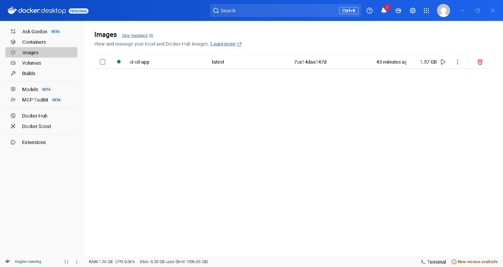

# 🚀 CI/CD Pipeline with GitHub Actions & Docker

## ✅ Project Overview  
This project demonstrates a fully automated *CI/CD pipeline* using *GitHub Actions* and *Docker*.  
It automates building a Docker image of a simple Node.js web application, pushing the image to Docker Hub, and optionally deploying it to Minikube.

---

## ✅ Features  
- Automated Docker image build and push using GitHub Actions  
- Docker Hub integration to store and share images  
- Simple Node.js web server running on port 3000  
- (Optional) Kubernetes deployment with Minikube  
- Demonstrates best practices in DevOps automation

---

## ✅ Tools Used  
- GitHub Actions  
- Docker  
- Docker Hub  
- Minikube (Optional)  
- Node.js

---

## ✅ How to Run Locally

1. Clone the repository  
   ```bash
   git clone https://github.com/your-username/your-repo-name.git
   cd your-repo-name

2. Build the Docker image

docker build -t your-image-name .


3. Run the Docker container

docker run -p 3000:3000 your-image-name


4. Open in browser
Visit: http://localhost:3000
You should see:
Hello from CI/CD Pipeline Project 🚀


---

✅ GitHub Actions Workflow

On every push to the main branch:

Checkout code

Build Docker image

Push to Docker Hub

(Optional) Deploy to Minikube


GitHub Secrets Required:

DOCKER_HUB_USERNAME

DOCKER_HUB_ACCESS_TOKEN

----
### Screenshots



-----
✅ Conclusion

This project simplifies development and deployment by automating the build, test, and deployment process, following industry-standard CI/CD practices.

👉 Would you like me to save this as a file (README.md) for you to download?
